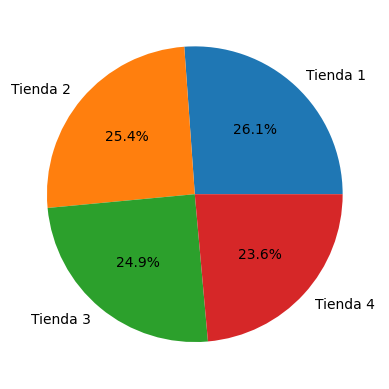
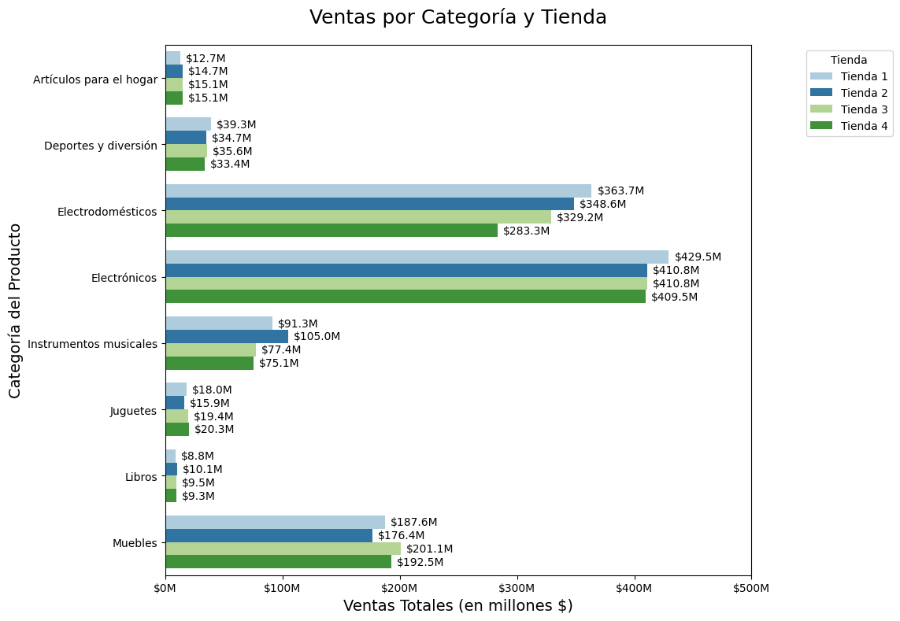

# AluraStore
Challenge Alura Store

Durante este desafío, ayudarás al Sr. Juan a decidir qué tienda de su cadena Alura Store debe vender para iniciar un nuevo emprendimiento. Para ello, se analizaron datos de ventas, rendimiento y reseñas de las 4 tiendas de Alura Store. El objetivo es identificar la tienda menos eficiente y presentar una recomendación final basada en los datos.

Estructura del Proyecto:
1. Análisis Exploratorio
2. Ingresos
3. Ventas por categoría
4. Calificación promedio de la tienda
5. Productos más o menos vendidos
6. Envío Promedio por Tienda
7. Recomendación

![VentasporAñoyTienda] (assets/Calificaciones.png)

Abrir archivo Desafio_Alura_Store_SMV.ipynb para ver notebook.

